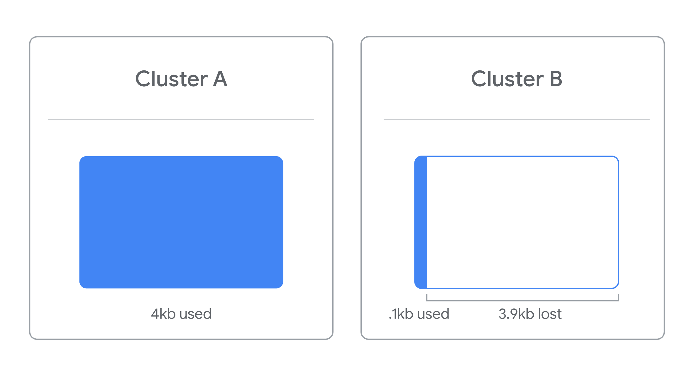

### Windows Disk Partitioning and Formatting a Filesystem 💻💾

#### 🔍 Overview

In Windows, you can manage disk partitions and format filesystems using built-in tools. This process involves both graphical and command-line methods to prepare disks for use. 

#### 🛠️ Using Disk Management Utility

1. **Accessing Disk Management**:
   - Right-click on "This PC" ➔ Select "Manage" ➔ Click "Disk Management".
   - This tool displays information about disks, partitions, and their file systems.

2. **Formatting a USB Drive**:
   - Insert the USB drive and let it be recognized.
   - Right-click on the partition and select "Format".
   - **File System**: Choose between FAT32, NTFS, etc. (NTFS is often preferred for larger files).
   - **Allocation Unit Size**: Choose a block size based on your storage needs (small for many small files, large for fewer large files).
   - **Quick Format**: Faster but skips error checking. **Full Format**: Slower but scans for errors.
   - **Compression**: Optional. Enabling it saves space but requires extra processing.

3. **Steps**:
   - **Volume Label**: Name the disk (e.g., "USB drive").
   - **File System**: Select NTFS.
   - **Allocation Unit Size**: Default is fine for most uses.
   - **Format**: Click "Okay" to proceed and confirm.

#### 💻 Using Command Line (diskpart)

1. **Launching Diskpart**:
   - Open Command Prompt and type `diskpart` to enter the disk management tool.

2. **Formatting a USB Drive**:
   - **List Disks**: `list disk` to display all disks.
   - **Select Disk**: Identify your USB drive by size, then `select disk [number]`.
   - **Clean Disk**: `clean` to remove existing partitions.
   - **Create Partition**: `create partition primary` to make a new partition.
   - **Select Partition**: `select partition 1` to choose the new partition.
   - **Make Active**: `active` to set it as an active partition.
   - **Format Disk**: `format fs=ntfs label="my-thumb-drive" quick` to format with NTFS and name it "my-thumb-drive".

#### 🎯 Key Takeaways

- **Disk Management** provides an intuitive GUI for disk partitioning and formatting.
- **diskpart** offers a command-line method for more advanced or automated tasks.
- Choosing the right file system and formatting options can optimize disk performance and compatibility.

With these tools and techniques, you can efficiently manage disk partitions and filesystems on Windows, ensuring that your storage is properly configured and optimized for your needs. 🚀🛠️

---

### Supplemental Reading for Disk Partitioning and Formatting in Windows 📚💻

#### 🔍 **Disk Partitioning and Formatting Overview**

Disk partitioning helps in managing hard disk space efficiently by dividing the disk into smaller, manageable segments. This process enhances the organization of storage and can help in optimizing disk usage. The Windows utility `DiskPart` provides a command-line interface for managing disk partitions and volumes.

#### 🛠️ **DiskPart Utility**

- **Functionality**: DiskPart allows you to create, delete, merge, or expand partitions and volumes. It also enables the assignment of file systems to partitions or volumes.
- **Components**:
  - **Cluster**: The smallest unit of storage space on a disk. This size determines how much space a file will consume. Even a small file will occupy the entire cluster size.
  - **Volume**: A single accessible storage area with one file system, which may span across multiple disks.
  - **Partition**: A logical division of a hard disk, creating distinct sections on the drive. It is often used to install multiple operating systems on the same disk.

#### 🔢 **Cluster Size**

- **Definition**: Cluster size is the minimum amount of space allocated for a file on a disk. A file will use up an entire cluster regardless of its actual size.

- **Impact**: For example, if the cluster size is 4 KB and you store a file of 4.1 KB, it will occupy 2 clusters, leading to a potential waste of 3.9 KB of disk space.
- **Optimization**: When partitioning a disk, choosing an appropriate cluster size based on your file sizes is crucial. Default cluster sizes might not always be optimal, potentially leading to inefficient storage usage.

#### ⚙️ **Using DiskPart**

- **Commands**: DiskPart commands are used to perform actions on disks, partitions, and volumes. Examples include creating new partitions, deleting existing ones, and formatting volumes.
- **Permanent Changes**: Actions performed with DiskPart are permanent, so caution is required to avoid accidental data loss.

#### 🎯 **Key Takeaways**

- **DiskPart**: A powerful command-line tool for managing disks, partitions, and volumes.
- **Storage Divisions**:
  - **Cluster**: Minimum storage unit.
  - **Volume**: Accessible storage area with a single file system.
  - **Partition**: Logical division of a disk.
- **Cluster Size**: Crucial for efficient storage management; larger cluster sizes can lead to wasted space.

Understanding these concepts and tools will enhance your ability to manage disks and storage effectively in a Windows environment. 🚀🗂️